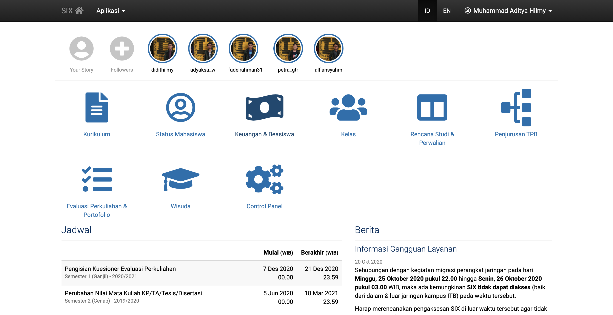

# Akademik Stories

This is a Chrome extension that adds an Instagram-like Stories feature to SIX ITB!

## Development Guide
Chrome extension source code is in [`extension`](extension), refer to Google Chrome Extensions developers guide.

Django code is in [`backend`](backend). Please figure it out for yourself :)

## Installation Guide
Download and install the Chrome extension (crx) file [akastories.crx](https://github.com/didithilmy/akademik-stories/releases/download/v0.0.1/akastories.crx), then follow the instructions.